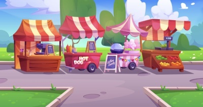
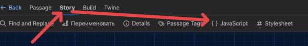
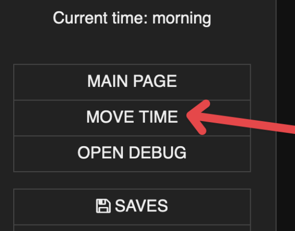

# Quick Start

- [Quick Start](#quick-start)
  - [Step 0 - How to install](#step-0---how-to-install)
  - [Step 1 - Embedded events (`type: "embedded"`)](#step-1---embedded-events-type-embedded)
  - [Step 2 - Interrupting events (`type: "goto"`)](#step-2---interrupting-events-type-goto)
  - [Step 3 - Groupe events](#step-3---groupe-events)
  - [Step 4 - Adding new events to the group](#step-4---adding-new-events-to-the-group)
  - [Step 5 - Enable/disable events](#step-5---enabledisable-events)
  - [Step 6 - Filters](#step-6---filters)
  - [Step 7 - Limits](#step-7---limits)
    - [Step 7.1 - Simple limitation strategy](#step-71---simple-limitation-strategy)
    - [Step 7.2 - Using variables](#step-72---using-variables)
    - [Step 7.3 - Resolve the same tags issue](#step-73---resolve-the-same-tags-issue)
    - [Step 7.4 - Dialogs beautify](#step-74---dialogs-beautify)
    - [Step 7.5 - The last but not least, reset limits on day-end](#step-75---the-last-but-not-least-reset-limits-on-day-end)
  - [Results](#results)
  - [Next steps](#next-steps)

Let's say you wrote the market passage

```html
:: Market


You are in vegetable market, where the air was rich with the scent of fresh produce and the vibrant colors of the stalls created a lively, welcoming atmosphere.
As they moved through the crowd, the mix of sounds and smells enveloped them, grounding them in the simple beauty of the moment.

You have $appleCount apple(s).
<<link [[Buy an apple|passage()]]>><<set $appleCount += 1>><</link>>

<<button [[Reload page|passage()]]>><</button>>
```

[Open market passage demo page](https://twee-sugarcube-random-events.nyc3.cdn.digitaloceanspaces.com/quick_start_step0.html)

But the page looks very static, lifeless.
Let's add random events to make it more live
Step by step.

## Step 0 - How to install

Here we will find out how to install random events library to your project

**If you use [Tweego](https://www.motoslave.net/tweego/) to build your project, then**

Copy file [passage-metadata.min.js](https://github.com/TweePower/twee-sugarcube-passage-metadata-collector/blob/main/dist/passage-metadata.min.js) (or you can use debug build: [passage-metadata.js](https://github.com/TweePower/twee-sugarcube-passage-metadata-collector/blob/main/dist/passage-metadata.js))

Copy file [random-event.min.js](https://github.com/TweePower/twee-sugarcube-random-events/blob/main/dist/random-event.min.js) (or you can use debug build: [random-event.js](https://github.com/TweePower/twee-sugarcube-random-events/blob/main/dist/random-event.js))

And paste it into folder with other js files

> [!NOTE]
> if you don't use specific folder with js files then you can copy/paste content to passage with `[script]` tag

**If you use [Twinery](https://twinery.org/") to build your project, then**

Copy content from file [passage-metadata.min.js](https://github.com/TweePower/twee-sugarcube-passage-metadata-collector/blob/main/dist/passage-metadata.min.js) (or you can use debug build: [passage-metadata.js](https://github.com/TweePower/twee-sugarcube-passage-metadata-collector/blob/main/dist/passage-metadata.js))

Copy content from file [random-event.min.js](https://github.com/TweePower/twee-sugarcube-random-events/blob/main/dist/random-event.min.js) (or you can use debug build: [random-event.js](https://github.com/TweePower/twee-sugarcube-random-events/blob/main/dist/random-event.js))

Open JavaScript window:



And paste content theare

## Step 1 - Embedded events (`type: "embedded"`)

Here we will look at how to add embedded events to a passage.
Embedded events do not change the passage but only complement it.
Players can simply ignore this, so such events can be used to add optional events or to add background dialogs.

Create two event passages

```html
:: MarketNeedHeroEvent [passage_metadata]
<<PassageMetadata>>{
    type: "embedded",
    threshold: 50,
}<</PassageMetadata>>
Hey, I know you! You are hero! Can you help me?
...
```

[Open the event passage code on GitHub](../twee/quickStart/step1/events/MarketNeedHeroEvent.twee)

```html
:: MarketHiddenStoreEvent [passage_metadata]
<<PassageMetadata>>{
    type: "embedded",
    threshold: 50,
}<</PassageMetadata>>
Hi there, do you want to buy really rare?
...
```

[Open the event passage code on GitHub](../twee/quickStart/step1/events/MarketHiddenStoreEvent.twee)

Add events into your passage

```html
<<RE [[MarketNeedHeroEvent]]>>\
<<RE [[MarketHiddenStoreEvent]]>>\
```

[Open the market passage code on Github](../twee/quickStart/step1/Market.twee)

That's it, now market passage looks better.
But those events are just optional. In the next step, let's add an event that interrupts the market and redirects the player to the event passage.

[Open market passage demo page](https://twee-sugarcube-random-events.nyc3.cdn.digitaloceanspaces.com/quick_start_step1.html)

## Step 2 - Interrupting events (`type: "goto"`)

Here we will look at how interrupting events works and how to add it to a passage.
Interrupting events redirects player to a event passage
Players can't skip it, so such events can be used to completely change the behavior of a passage.

Create event passages

```html
:: MarketStealEvent [passage_metadata]
<<PassageMetadata>>{
    type: "goto",
    threshold: 50,
}<</PassageMetadata>>

Entering the market, a girl ran up to you, hugged you, giggled and ran on
As soon as you came to your senses, you discovered that she had pulled out your wallet
...
```

[Open the event passage code on GitHub](../twee/quickStart/step2/events/MarketStealEvent.twee)

Add events into your passage

```html
<<RE [[MarketStealEvent]]>>\
```

[Open the market passage code on Github](../twee/quickStart/step2/Market.twee)

Now market passage contain interupting event

[Open market passage demo page](https://twee-sugarcube-random-events.nyc3.cdn.digitaloceanspaces.com/quick_start_step2.html)

## Step 3 - Groupe events

Now, in the market passage, different events are called sequentially
It looks good, but there are several problems

- There is a possibility that several events will be called at once
- The probability that at least one event out of three will trigger is 87.5% (because three events are called sequentially by 50%)
- It is not clear how to make it so that exactly one event is called with 100% probability
To solve these problems, you can use groups

Add group to all events

```html
groups: ["MarketEvents"],
```

[Open the events passages folder on GitHub](../twee/quickStart/step3/events/MarketStealEvent.twee)

Replace events calling to group call in marker passage
replace:

```html
<<RE [[MarketNeedHeroEvent]]>>\
<<RE [[MarketHiddenStoreEvent]]>>\
<<RE [[MarketStealEvent]]>>\
```

to:

```html
<<REGroup "MarketEvents" 1 100>>
```

[Open the market passage code on Github](../twee/quickStart/step3/Market.twee)

Now in the market passage with 100% probability exactly one event from the group will be called

[Open market passage demo page](https://twee-sugarcube-random-events.nyc3.cdn.digitaloceanspaces.com/quick_start_step3.html)

## Step 4 - Adding new events to the group

Groups also have one advantage: to add new events to groups, you no longer need to change the market passage
Now easy to add new events to group

Create five event passages

```html
:: MarketDialogEvent1 [passage_metadata]
<<PassageMetadata>>{
    type: "embedded",
    threshold: 50,
    groups: ["MarketEvents"]
}<</PassageMetadata>>

You hear a dialogue between the Buyer and the Seller:
...
```

[Open the events passages code on GitHub](../twee/quickStart/step4/events/MarketDialogsEvents.twee)

And that's all, the events have already been added to the groups and now in market passage there are both old events and new events with dialogues

[Open market passage demo page](https://twee-sugarcube-random-events.nyc3.cdn.digitaloceanspaces.com/quick_start_step4.html)

## Step 5 - Enable/disable events

As the story progresses, some events can be turned on or off
In our example, this could be the `"MarketNeedHeroEvent"` event. After finishing this side quest need to disable the event

Disable the event after completing the side quest. For this, add to the passage `"MarketNeedHeroEventAcceptQuest"`

```html
Side quest was complite
<<REDisable [[MarketNeedHeroEvent]]>>\
```

[Open the event passage code on GitHub](../twee/quickStart/step5/events/MarketNeedHeroEvent.twee)

And that's all, player will see notification about that the quest was complite and this event willn't start again

[Open market passage demo page](https://twee-sugarcube-random-events.nyc3.cdn.digitaloceanspaces.com/quick_start_step5.html)

## Step 6 - Filters

Some events should not be available immediately after the start
Sometimes, you can enable them after some plot twist, but most often, it is easier to use filters
In our example, this could be `"MarketHiddenStoreEvent"`. You can add a filter so that this event is available only after five apples are purchased

Add a filter to the hidden store `<<PassageMetadata>>` to make it accessible only after 5 apples have been purchased

```html
filter: `$appleCount >= 5`,
```

[Open the event passage code on GitHub](../twee/quickStart/step6/events/MarketHiddenStoreEvent.twee)

And that's it, the player won't see the hidden shop event until he buys 5 apples

[Open market passage demo page](https://twee-sugarcube-random-events.nyc3.cdn.digitaloceanspaces.com/quick_start_step6.html)

## Step 7 - Limits

Everything looks good, but there are inconsistencies in the events that are repeated constantly
For example, some events are more logical to limit running only once a day, and other events can be limited by the time of day
We can use filters for that, but better to use limitations for that

This is probably one of the most difficult steps, the strategies of limitations are complex functionality, but I will try to add a description for each step

### Step 7.1 - Simple limitation strategy

Add limitations to `"MarketStealEvent"` so that it is only available once per day.
For this need to add tags and limitationStrategies to PassageMetadata

```html
tags: ["Market", "Daily"],
limitationStrategies: [
    { max: 1, tags: ["Market", "Daily"] },
],
```

> [!NOTE]
> `tags: ["Market", "Daily"],` are needed to understand what strategy can be applied now.
> In this example, the tags match because it is a simple strategy, but tags can also store variables or even expressions (for example: `tags: ["$CurrentPlace", "$appleCount > 10 ? 'buyer': 'just_watch'"],`).

> [!NOTE]
> `max` in limitationStrategies means how many times an event may be started by that limitation.

> [!WARNING]
> Warning: However, the event will be skipped if limitationStrategies contains items with tags and no one item doesn't contain tags that exist in PassageMetadata tags.

### Step 7.2 - Using variables

Let's do the same for MarketHiddenStoreEvent but make it available only in noon and afternoon

```html
tags: ["Market", "Daily", "$CurrentDayTime"],
limitationStrategies: [
    { max: 1, tags: ["Market", "Daily", "Noon"]},
    { max: 1, tags: ["Market", "Daily", "Afternoon"]},
    { max: 1, tags: ["Market", "Daily"]},
],
```

> [!NOTE]
> Here we use variable in tags and have limitationStrategies with 3 items
>
> - `{ max: 1, tags: ["Market", "Daily", "Noon"]},` - mean that this event may start just once at the noon
> - `{ max: 1, tags: ["Market", "Daily", "Afternoon"]},` - mean that this event may start just once at the afternoon
> - `{ max: 1, tags: ["Market", "Daily"]},` - mean that this event may start just once during the day, without this limitation, an event may be started two times (at noon and afternoon)

Looks good, but there is a problem here, it is that limitationStrategies works globally for all events, this is done to remove "spam" of events, so it is possible to run one event from a set and thus limit the launch of other events with the same tags in limitationStrategies
We have two events with the strategy `["Market", "Daily"]`, which means that after one event has triggered, the second event will no longer trigger because an event with such tags has already been triggered earlier

### Step 7.3 - Resolve the same tags issue

There are two ways to fix this:

- Add a specific tag to each event (example: `["Market", "Daily", "MyCustomTag"]`)
- Add `isSeparate: true` to necessary limitationStrategies items

We will consider the second way

```html
tags: ["Market", "Daily"],
limitationStrategies: [
    { max: 1, tags: ["Market", "Daily"], isSeparate: true },
],
```

[Open the event passage code on GitHub](../twee/quickStart/step7/events/MarketStealEvent.twee)

```html
tags: ["Market", "Daily", "$CurrentDayTime"],
limitationStrategies: [
    { max: 1, tags: ["Market", "Daily", "Noon"], isSeparate: true },
    { max: 1, tags: ["Market", "Daily", "Afternoon"], isSeparate: true },
    { max: 1, tags: ["Market", "Daily"], isSeparate: true },
],
```

[Open the event passage code on GitHub](../twee/quickStart/step7/events/MarketHiddenStoreEvent.twee)

Events now work independently of each other

### Step 7.4 - Dialogs beautify

Now, the dialogues between the seller and the buyer work at any time of the day. This looks implausible.
Add limitationStrategies to each dialogue to make them available only during noon and afternoon

```html
tags: ["Market", "Daily", "$CurrentDayTime"],
limitationStrategies: [
    { max: 10, tags: ["Market", "Daily", "noon"] },
    { max: 10, tags: ["Market", "Daily", "afternoon"] },
],
```

Also add dialogues for morning and evening

```html
:: MarketDialogEvent6 [passage_metadata]
<<PassageMetadata>>{
    type: "embedded",
    threshold: 50,
    groups: ["MarketEvents"],
    tags: ["Market", "Daily", "$CurrentDayTime"],
    limitationStrategies: [
        { max: 4, tags: ["Market", "Daily", "evening"] },
    ],
}<</PassageMetadata>>

You hear a dialogue between sellers:
...
```

[Open the events passages folder on GitHub](../twee/quickStart/step3/events/MarketStealEvent.twee)

Perfect, now dialogs loocs really good

### Step 7.5 - The last but not least, reset limits on day-end

All restrictions must be reset to play the events again on the new day.
A widget "ChangeTime" was created to change the time.

```html
:: DayTimeWidgets [widget]
<<widget "ChangeTime">>
    <<set _index = $DayTimeArray.indexOf($CurrentDayTime)>>
    <<if (_index + 1 >= $DayTimeArray.length)>>
        <<set $CurrentDayTime = $DayTimeArray[0]>>
    <<else>>
        <<set $CurrentDayTime = $DayTimeArray[_index + 1]>>
    <</if>>
<</widget>>
```

Let's add a reset limits code at the end of this widget.

```html
<<if $CurrentDayTime === 'morning'>>
    <<REResetByTag "Daily">>
<</if>>
```

[Open the widget passage code on GitHub](../twee/quickStart/step7/DateTimeWidgets.twee)

Excellent. Now, all limits work fine. We have daily events and different dialogues depending on the time of day, and at the end of the day, all limits are reset.

Note: To change time, use the button "Move time" in the sidebar


[Open market passage demo page](https://twee-sugarcube-random-events.nyc3.cdn.digitaloceanspaces.com/quick_start_step7.html)

## Results

Now the market looks more alive. There are side quests, dialogues, and a hidden store. And it all looks logical. Not all events are available from the start, some are available only once, and there are those that are available only at a certain time of day.

**But the most important thing** is that these events are very easy to maintain and add new events. Market passage does not have hundreds of if/else constructions that plunge you into horror, all the settings are in the events themselves, and market passage contains only one line

```html
<<REGroup "MarketEvents" 1 100>>
```

[Open the result code folder on GitHub](../twee/quickStart/step7)

[Open the result market passage demo page](https://twee-sugarcube-random-events.nyc3.cdn.digitaloceanspaces.com/quick_start_step7.html)

Below, I tried to create an example of the result market passage but without using the library.

Without using the library, the code could look like this

<details><summary>Show/Hide</summary>

```html
<<switch $currentDayTime>>\
    <<case "Morning">>\
        <<set _events = []>>\
        <<if ($marketDialogEventCalledAtMorningTimes < 10)>>\
            <<set _events.push('MarketDialogEvent8')>>\
            <<set _events.push('MarketDialogEvent9')>>\
        <</if>>\
        <<if (!$isMarketNeedHeroEventFinished)>>\
            <<set _events.push('MarketNeedHeroEvent')>>\
        <</if>>\
        <<if (!$isMarketStealEventCalledToday)>>\
            <<set _events.push('MarketStealEvent')>>\
        <</if>>\
        <<if _events.length > 0>>\
            <<set _r = random(0, _events.length - 1)>>\
            <<set _event = _events[_r]>>\
            <<if _event === 'MarketDialogEvent8' or _event === 'MarketDialogEvent9'>>\
                <<set $marketDialogEventCalledAtMorningTimes += 1>>\
                <<include [[_event]]>>\
            <</if>>\
            <<if _event === 'MarketNeedHeroEvent'>>\
                <<include [[MarketNeedHeroEvent]]>>\
            <</if>>\
            <<if _event === 'MarketStealEvent'>>\
                <<set $isMarketStealEventCalledToday = true>>\
                <<goto [[MarketStealEvent]]>>\
            <</if>>\
        <</if>>\
    <<case "Noon">>\
        <<set _events = []>>\
        <<if ($marketDialogEventCalledAtNoonTimes < 10)>>\
            <<set _events.push('MarketDialogEvent1')>>\
            <<set _events.push('MarketDialogEvent2')>>\
            <<set _events.push('MarketDialogEvent3')>>\
            <<set _events.push('MarketDialogEvent4')>>\
            <<set _events.push('MarketDialogEvent5')>>\
        <</if>>\
        <<if (!$isMarketNeedHeroEventFinished)>>\
            <<set _events.push('MarketNeedHeroEvent')>>\
        <</if>>\
        <<if (!$isMarketStealEventCalledToday)>>\
            <<set _events.push('MarketStealEvent')>>\
        <</if>>\
        <<if ($appleCount >= 5 and !$isMarketHiddenStoreEventCalledToday)>>\
            <<set _events.push('MarketHiddenStoreEvent')>>\
        <</if>>\
        <<if _events.length > 0>>\
            <<set _r = random(0, _events.length - 1)>>\
            <<set _event = _events[_r]>>\
            <<if _event === 'MarketDialogEvent1' or _event === 'MarketDialogEvent2' or _event === 'MarketDialogEvent3' or _event === 'MarketDialogEvent4' or _event === 'MarketDialogEvent5'>>\
                <<set $marketDialogEventCalledAtNoonTimes += 1>>\
                <<set _rr = random(0, 4)>>\
                <<include [[_event]]>>\
            <</if>>\
            <<if _event === 'MarketNeedHeroEvent'>>\
                <<include [[MarketNeedHeroEvent]]>>\
            <</if>>\
            <<if _event === 'MarketStealEvent'>>\
                <<set $isMarketStealEventCalledToday = true>>\
                <<goto [[MarketStealEvent]]>>\
            <</if>>\
            <<if _event === 'MarketHiddenStoreEvent'>>\
                <<set $isMarketHiddenStoreEventCalledToday = true>>\
                <<include [[MarketHiddenStoreEvent]]>>\
            <</if>>\
        <</if>>\
    <<case "Afternoon">>\
        <<set _events = []>>\
        <<if ($marketDialogEventCalledAtAfternoonTimes < 10)>>\
            <<set _events.push('MarketDialogEvent1')>>\
            <<set _events.push('MarketDialogEvent2')>>\
            <<set _events.push('MarketDialogEvent3')>>\
            <<set _events.push('MarketDialogEvent4')>>\
            <<set _events.push('MarketDialogEvent5')>>\
        <</if>>\
        <<if (!$isMarketNeedHeroEventFinished)>>\
            <<set _events.push('MarketNeedHeroEvent')>>\
        <</if>>\
        <<if (!$isMarketStealEventCalledToday)>>\
            <<set _events.push('MarketStealEvent')>>\
        <</if>>\
        <<if ($appleCount >= 5 and !$isMarketHiddenStoreEventCalledToday)>>\
            <<set _events.push('MarketHiddenStoreEvent')>>\
        <</if>>\
        <<if _events.length > 0>>\
            <<set _r = random(0, _events.length - 1)>>\
            <<set _event = _events[_r]>>\
            <<if _event === 'MarketDialogEvent1' or _event === 'MarketDialogEvent2' or _event === 'MarketDialogEvent3' or _event === 'MarketDialogEvent4' or _event === 'MarketDialogEvent5'>>\
                <<set $marketDialogEventCalledAtAfternoonTimes += 1>>\
                <<set _rr = random(0, 4)>>\
                <<include [[_event]]>>\
            <</if>>\
            <<if _event === 'MarketNeedHeroEvent'>>\
                <<include [[MarketNeedHeroEvent]]>>\
            <</if>>\
            <<if _event === 'MarketStealEvent'>>\
                <<set $isMarketStealEventCalledToday = true>>\
                <<goto [[MarketStealEvent]]>>\
            <</if>>\
            <<if _event === 'MarketHiddenStoreEvent'>>\
                <<set $isMarketHiddenStoreEventCalledToday = true>>\
                <<include [[MarketHiddenStoreEvent]]>>\
            <</if>>\
        <</if>>\
    <<case "Evening">>\
        <<set _events = []>>\
        <<if ($marketDialogEventCalledAtEveningTimes < 10)>>\
            <<set _events.push('MarketDialogEvent6')>>\
            <<set _events.push('MarketDialogEvent7')>>\
        <</if>>\
        <<if (!$isMarketNeedHeroEventFinished)>>\
            <<set _events.push('MarketNeedHeroEvent')>>\
        <</if>>\
        <<if (!$isMarketStealEventCalledToday)>>\
            <<set _events.push('MarketStealEvent')>>\
        <</if>>\
        <<if _events.length > 0>>\
            <<set _r = random(0, _events.length - 1)>>\
            <<set _event = _events[_r]>>\
            <<if _event === 'MarketDialogEvent6' or _event === 'MarketDialogEvent7'>>\
                <<set $marketDialogEventCalledAtEveningTimes += 1>>\
                <<set _rr = random(0, 4)>>\
                <<include [[_event]]>>\
            <</if>>\
            <<if _event === 'MarketNeedHeroEvent'>>\
                <<include [[MarketNeedHeroEvent]]>>\
            <</if>>\
            <<if _event === 'MarketStealEvent'>>\
                <<set $isMarketStealEventCalledToday = true>>\
                <<goto [[MarketStealEvent]]>>\
            <</if>>\
        <</if>>\
    <<case "Night">>\
        <<set _events = []>>\
        <<if (!$isMarketNeedHeroEventFinished)>>\
            <<set _events.push('MarketNeedHeroEvent')>>\
        <</if>>\
        <<if (!$isMarketStealEventCalledToday)>>\
            <<set _events.push('MarketStealEvent')>>\
        <</if>>\
        <<if _events.length > 0>>\
            <<set _r = random(0, _events.length - 1)>>\
            <<set _event = _events[_r]>>\
            <<if _event === 'MarketNeedHeroEvent'>>\
                <<include [[MarketNeedHeroEvent]]>>\
            <</if>>\
            <<if _event === 'MarketStealEvent'>>\
                <<set $isMarketStealEventCalledToday = true>>\
                <<goto [[MarketStealEvent]]>>\
            <</if>>\
        <</if>>\
<</switch>>
```

</details>

[Open the code without using a library on GitHub](../twee/quickStart/step7withoutRE/Market.twee)

[Open the market passage demo page (without using a library)](https://twee-sugarcube-random-events.nyc3.cdn.digitaloceanspaces.com/quick_start_step7withoutRE.html)

As you see, without using the library, this code:

- contains many duplicates (which means that if you need to change something, you will need to change it in several places)
- it is quite difficult to understand
- it is easy to make mistakes and it is difficult to find them later
- and it is much more difficult to add new events
- also, if you need to add the same events somewhere, there will be even more duplicate code

## Next steps

TBD
